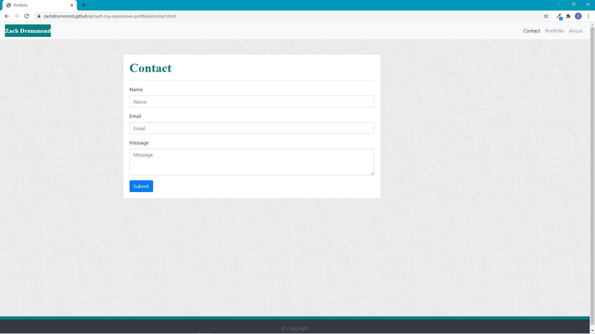
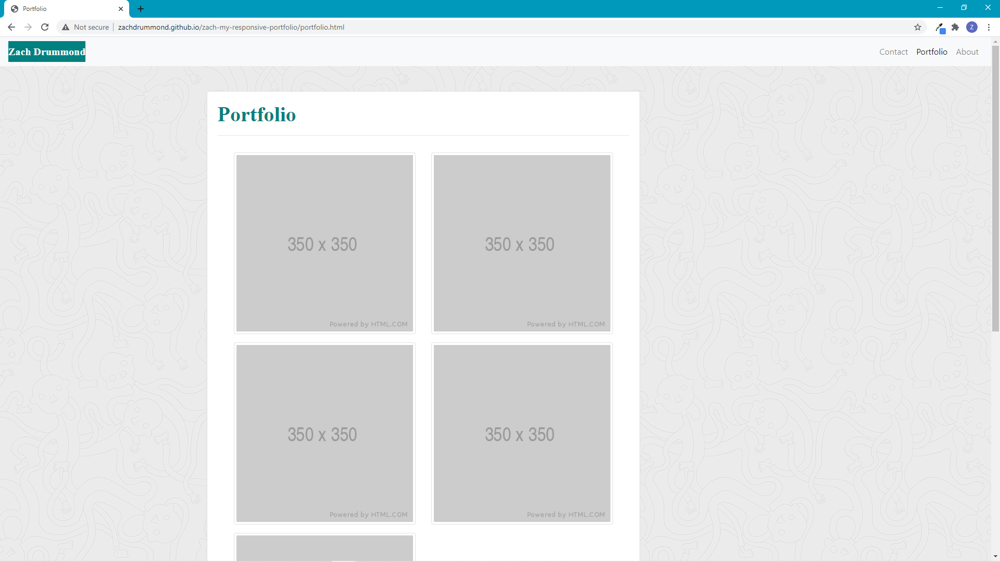
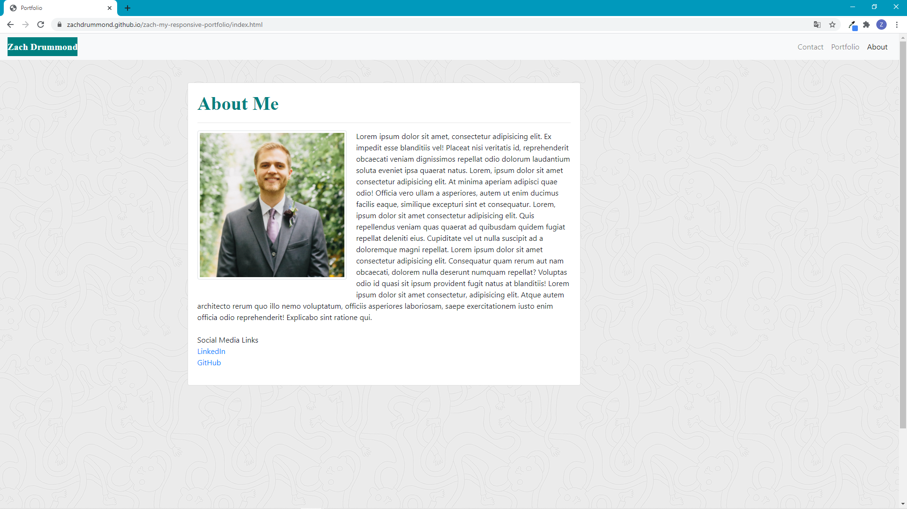

# My Responsive Portfolio - Prototype

## Table of Contents
* [Description](#Description)
* [Links](#Links)
* [Design Elements](#Design-Elements)
* [Pages Preview](#Pages-Preview)
* [Credits](#Credits)

## Description
This is a prototype of my responsive portfolio. I designed this website in such a way that it would render well on a variety of devices and screen sizes. I hope to be able to use this website one day to showcase all of my web applications, provide a basic profile of me, and give others a place to contact me.

## Links
* Website: https://zachdrummond.github.io/portfolio-prototype/
* GitHub Repository: https://github.com/zachdrummond/portfolio-prototype

## Design Elements
* HTML
* CSS
* Bootstrap

## Pages Preview
### *Contact*

### *Portfolio*

### *About*

## Credits
* Bootstrap: https://getbootstrap.com/